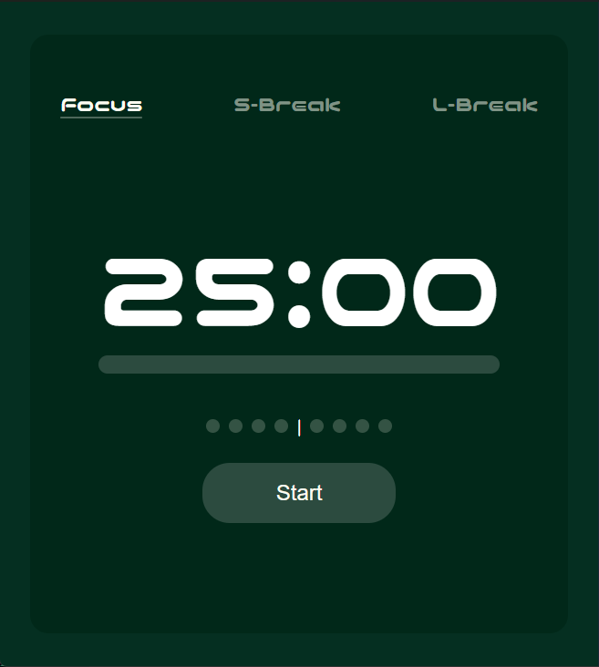

# Kizen ⏳

A minimalist, desktop-native productivity suite designed to keep you focused and organized.

Kizen is not just a website; it's a lightweight desktop application built with modern web technologies and powered by a Go backend. It combines a Pomodoro timer, task management, and daily scheduling into one sleek, distraction-free interface.

> ****

## ✨ Current Features

- **Custom Pomodoro Timer:** Seamlessly switch between Focus (25m), Short Break (5m), and Long Break (15m).
- **Dynamic Progress Bar:** A smooth, custom-built progress indicator that tracks your current session.
- **Session Tracking:** Visual dot-indicators to track your completed Focus cycles before a Long Break.
- **Sidebar Navigation:** Custom routing architecture to switch between productivity tools without reloading.
- **Minimalist UI:** Dark-mode by default, featuring custom CSS Modules and the futuristic _Nico Moji_ font.

## 🚀 Upcoming Features (Roadmap)

- [ ] **Tasks (Todo List):** Add, complete, and track daily tasks.
- [ ] **Schedule:** Plan your day visually.
- [ ] **Achievements:** Gamification system to keep you motivated.
- [ ] **System Notifications:** Native OS push-notifications when a timer ends (via Go backend).

## 🛠️ Tech Stack

This project uses a "Frontend-heavy" architecture wrapped in a lightweight Go binary.

- **Framework:** [Wails v2](https://wails.io/) (Produces a native `.exe` / `.app` without bundled Chromium)
- **Frontend:** React + TypeScript + Vite
- **Styling:** Vanilla CSS Modules (No heavy UI libraries, 100% custom styling)
- **Backend/System:** Go (Golang)

## 💻 How to run locally

If you want to run Kizen in development mode on your machine:

1. Ensure you have **Go** and **Node.js** installed.
2. Install the Wails CLI:
   ```bash
   go install github.com/wailsapp/wails/v2/cmd/wails@latest
   ```
3. Clone this repository and run the dev server:
   git clone https://github.com/hyhy2121/Kizen.git
   cd Kizen
   wails dev

4. To build a standalone executable file (.exe):
   wails build
